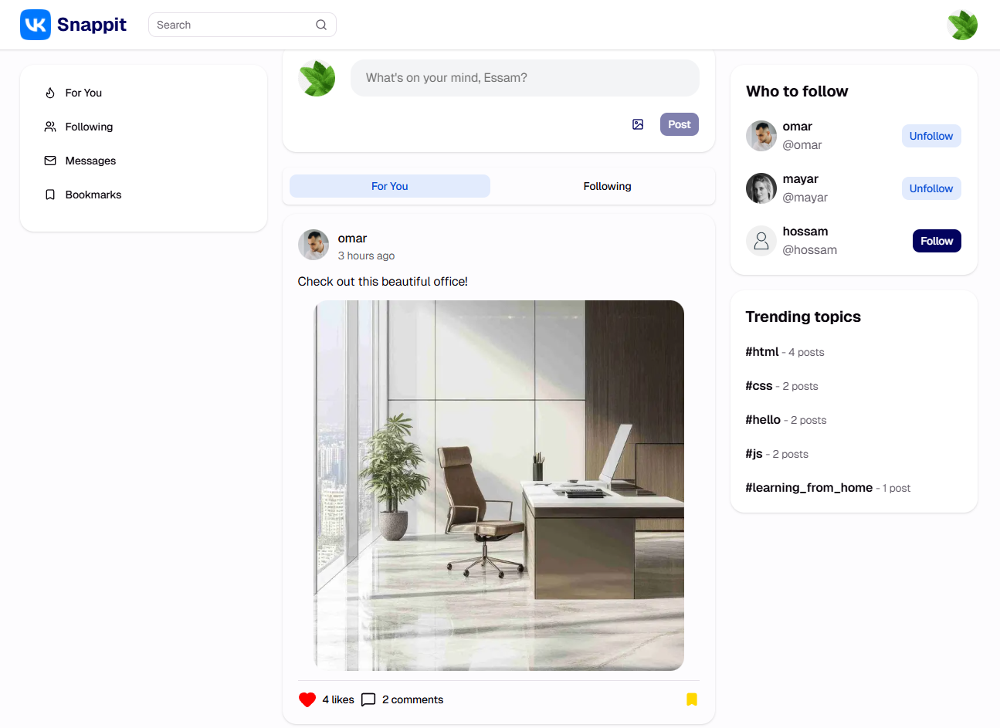

# Snappit - Social Media App [🔗](https://social-app-liart-six.vercel.app/)

A full-stack social media application built with Next.js App Router, Prisma, React Query, UploadThing, and Stream Chat.

## Key Features

- **Server-side rendering (SSR)** with Next.js App Router and server components for fast initial page loads.
- **React Query** used globally via `QueryClientProvider` to manage remote data, caching, pagination, and invalidation.
- **Optimistic UI updates** for follow/unfollow, likes, and bookmarks to keep the app feeling fast.
- **Authentication & Autorization** Login and Signup system with the ability to login with username or email by applying input validation.
- **UploadThing integration** for authenticated image and media uploads, including avatar updates and post attachments.
- **Bookmarks** feed for saving posts and viewing bookmarked content using infinite queries.
- **Comments** with server-validated creation and deletion flows.
- **Likes** with live like-count updates and persisted user state.
- **Nested routing groups** using the Next.js app router for logical layout grouping under `(auth)`, `(main)`, `(feeds)`, and feature routes.
- **Follow / unfollow** user interactions with a dedicated `FollowButton` component and backend follow routes.
- **Input sanitization and validation** via Zod schemas, plus hashtag search powered by Prisma content queries.
- **Real-time messaging** powered by Stream Chat with authenticated tokens and client-side chat components.
- **Compound components** used in search field with shared logic between different UI components.

## Architecture Overview

### Next.js App Router

The app uses the Next.js App Router with nested route groups:

- `(auth)` for login/signup and auth-related pages
- `(main)` for the main authenticated experience
- `(feeds)` for feed pages like Following and For You
- Dynamic routes for `hashtag/[slug]` and `users/[username]`

### React Query

A custom `ReactQueryProvider` wraps the app with a `QueryClient`. Common patterns include:

- `useQuery` for fetching `like`, `bookmark`, `follower`, and `message` state
- `useInfiniteQuery` for feed pagination and bookmark lists
- `useMutation` with `onMutate` and rollback in `onError` for optimistic updates

### UploadThing

The project integrates UploadThing with:

- `src/app/api/uploadthing/core.ts` for file router setup
- `src/app/api/uploadthing/route.ts` for UploadThing route handling
- `NextSSRPlugin` in `src/app/layout.tsx` to support UploadThing in SSR environments

Upload types include avatar uploads, image attachments, and video attachments.

### Prisma & Validation

Prisma is used for all data models and queries:

- `POST` creation with attachments and user associations
- `POST` bookmark and like toggles
- `COMMENT` create/delete operations
- `FOLLOW` / `UNFOLLOW` operations via user follower routes
- Hashtag discovery using Prisma `contains` search on post content

Input validation is enforced with Zod in `src/validation/validation.ts` for:

- signup and login forms
- new post content and attachment limits
- comment creation
- profile updates

### Real-time Messaging

The messaging experience is built with Stream Chat:

- `src/lib/stream.ts` initializes the server-side Stream client
- `src/app/api/get-token/route.ts` issues user tokens for chat authentication
- `src/app/(main)/messages/use-initialize-chat-client.tsx` connects the client-side StreamChat instance
- `src/app/(main)/messages/chat.tsx` renders real-time chat with sidebar and channel views

## Feature Details

### Follow / Unfollow

The `FollowButton` component uses React Query and optimistic updates:

- fetches follower info with `useFollowerInfo`
- toggles follow state via `/api/users/[userId]/followers`
- updates the UI immediately while the network request completes

### Likes & Bookmarks

`LikeButton` and `BookmarkButton` both:

- query the current post state via React Query
- use `useMutation` and `onMutate` for immediate UI feedback
- roll back state on error

### Comments

Comment creation and deletion are handled server-side with validation and auth checks.

### Hashtag Search

Hashtag pages use a Prisma query that searches post content with `contains` and case-insensitive matching, so `#nextjs` and `#NextJS` are treated equivalently.

### Delete Post Confirmation

The delete post modal uses a compound component pattern with shared UI pieces:

- `DeleteStepOne` and `DeleteStepTwo` components for structured confirmation steps
- `DeleteStepOne.Divider` for reusable layout enforcement
- a final typed confirmation step before deletion

[Signup and use Snappit, It's free!](https://social-app-liart-six.vercel.app/signup)
